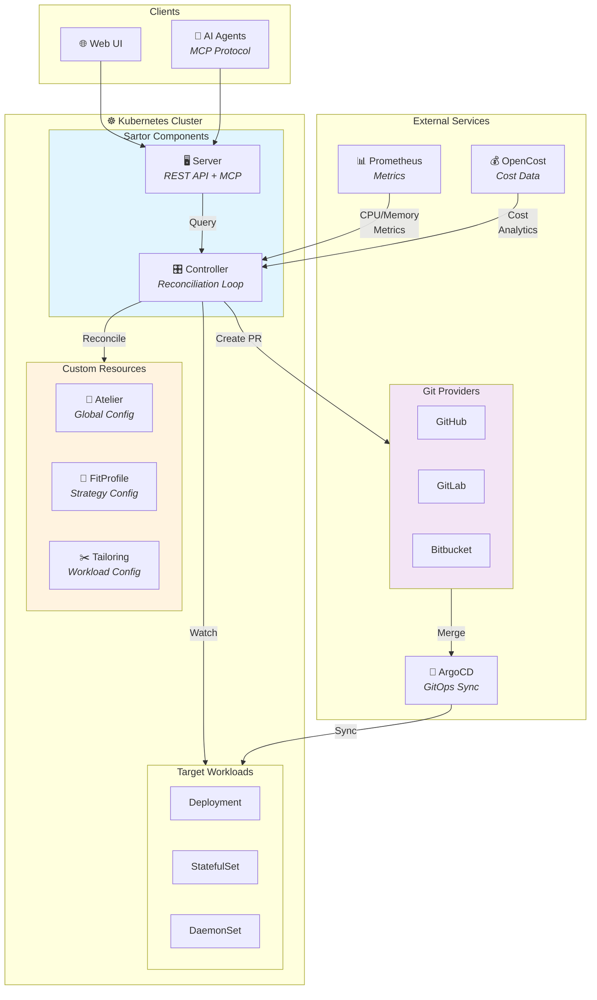

# Sartor

<div align="center">

[](https://github.com/sartorproj/sartor/actions/workflows/ci.yml)
[](https://github.com/sartorproj/sartor/actions/workflows/release.yml)
[](https://github.com/sartorproj/sartor/actions/workflows/security.yml)
[](https://goreportcard.com/report/github.com/sartorproj/sartor)
[](https://codecov.io/gh/sartorproj/sartor)
[](https://opensource.org/licenses/Apache-2.0)
[](https://golang.org/)
[](https://kubernetes.io/)


**Intelligent Kubernetes Resource Optimization with GitOps**

</div>

## Overview

**Sartor** is a Kubernetes controller that automatically optimizes resource requests and limits for your workloads. It observes real usage patterns, calculates intelligent recommendations, and creates GitOps pull requests to apply changes safely.

### Key Features

- 🎯 **Intent-Based Optimization**: Choose from Eco, Balanced, or Critical profiles
- 📊 **Flexible Recommendation Strategies**: Plugin-based system supporting percentile and DSP-based prediction
- 🔬 **DSP-Based Prediction**: Advanced time series forecasting using FFT and autocorrelation (inspired by [Crane](https://gocrane.io))
- 📈 **Peak Detection**: Advanced algorithms for detecting anomalous peaks in resource usage
- 🧹 **Data Preprocessing**: Automatic imputation, outlier removal, and normalization
- 🔄 **GitOps Integration**: Creates PRs for raw YAML, Helm, and Kustomize
- 🚨 **OOM Protection**: Automatically patches memory limits on OOMKilled events
- 🔗 **ArgoCD Support**: Auto-syncs ArgoCD applications after PR merge
- 🛡️ **Safety Rails**: Configurable min/max limits to prevent over-optimization
- ⏸️ **Dry-Run Mode**: Preview recommendations without creating PRs
- 📈 **Cost-Aware**: OpenCost integration for cost-based prioritization (coming soon)

## Quick Start

### Prerequisites

- Kubernetes cluster (v1.11.3+)
- Prometheus instance with container metrics
- Git repository access (GitHub, GitLab, or Bitbucket)
- kubectl configured to access your cluster

### Installation

#### Using Helm (Recommended)

```bash
helm repo add sartor https://sartorproj.github.io/sartor
helm install sartor sartor/sartor --namespace sartor-system --create-namespace
```

#### Using kubectl

```bash
kubectl apply -f https://github.com/sartorproj/sartor/releases/latest/download/install.yaml
```

### Basic Configuration

1. **Create an Atelier (global configuration):**

```yaml
apiVersion: autoscaling.sartorproj.io/v1alpha1
kind: Atelier
metadata:
  name: default
spec:
  prometheus:
    url: http://prometheus:9090
  gitProvider:
    type: github
    secretRef:
      name: github-token
      namespace: sartor-system
  prSettings:
    cooldownPeriod: 168h  # 7 days
    minChangePercent: 20
```

2. **Create a Tailoring (per-workload configuration):**

```yaml
apiVersion: autoscaling.sartorproj.io/v1alpha1
kind: Tailoring
metadata:
  name: payment-service
  namespace: production
spec:
  target:
    kind: Deployment
    name: payment-service
  intent: Balanced
  writeBack:
    strategy: RawYAML
    repository: "org/manifests"
    path: "apps/payment-service/deployment.yaml"
    branch: "main"
```

3. **Watch Sartor create optimization PRs!**

## Documentation

- [Getting Started Guide](docs/getting-started.md)
- [Configuration Reference](docs/configuration.md)
- [Recommendation Strategies](docs/recommendation-strategies.md) - Percentile vs DSP strategies
- [Intent Profiles Explained](docs/intent-profiles.md)
- [GitOps Integration](docs/gitops-integration.md)
- [ArgoCD Setup](docs/argocd-setup.md)
- [Troubleshooting](docs/troubleshooting.md)
- [API Reference](docs/api-reference.md)

## Architecture

Sartor consists of two main components:

1. **Controller**: Kubernetes controller that reconciles `Atelier`, `Tailoring`, and `FitProfile` resources
2. **Server**: REST API and MCP server for UI and AI agent integration



### Data Flow

1. **Metrics Collection**: Controller queries Prometheus for CPU/memory usage patterns
2. **Analysis**: Recommendation engine calculates optimal resources using configured strategy
3. **PR Creation**: Changes are proposed via Git pull requests (Raw YAML, Helm, or Kustomize)
4. **GitOps Sync**: After PR merge, ArgoCD automatically syncs changes to the cluster
5. **OOM Protection**: Controller monitors for OOMKilled events and can auto-patch limits

## Concepts

### Atelier
Cluster-scoped global configuration defining Prometheus connection, Git provider, and safety rails.

### Tailoring
Namespace-scoped configuration for a specific workload, defining optimization intent and write-back strategy.

### Cut
Represents a Git pull request created by Sartor, tracking PR status and changes.

## Intent Profiles

| Profile | Description | Buffer | Use Case |
|---------|-------------|--------|----------|
| **Eco** | Maximum cost savings | 10-15% | Non-critical workloads |
| **Balanced** | Balanced optimization | 20-25% | Most production workloads |
| **Critical** | Maximum reliability | 30-50% | Critical production services |

## Contributing

We welcome contributions! Please see our [Contributing Guide](CONTRIBUTING.md) for details.

1. Fork the repository
2. Create your feature branch (`git checkout -b feature/amazing-feature`)
3. Commit your changes (`git commit -m 'Add some amazing feature'`)
4. Push to the branch (`git push origin feature/amazing-feature`)
5. Open a Pull Request

### Development Setup

```bash
# Clone the repository
git clone https://github.com/sartorproj/sartor.git
cd sartor

# Install dependencies
go mod download

# Run tests
make test

# Run linter
make lint

# Build binaries
make build
```

## Roadmap

- [x] Phase 1: Foundation (MVP)
- [x] Phase 2: Integrations (Helm, Kustomize, ArgoCD, OOM)
- [ ] Phase 3: Intelligence (OpenCost, priority queue, anomaly detection)
- [ ] Phase 4: Interface & GreenOps (MCP server, UI dashboard, CO2 calculations)

See [VISION.md](VISION.md) for detailed roadmap.

## Security

Sartor follows security best practices:

- Regular security scans with Snyk and Trivy
- CodeQL analysis for vulnerability detection
- Go vulnerability checks with `govulncheck`
- Dependency review on all PRs

Report security issues to: security@sartorproj.io

## License

Copyright 2025.

Licensed under the Apache License, Version 2.0 (the "License");
you may not use this file except in compliance with the License.
You may obtain a copy of the License at

    http://www.apache.org/licenses/LICENSE-2.0

Unless required by applicable law or agreed to in writing, software
distributed under the License is distributed on an "AS IS" BASIS,
WITHOUT WARRANTIES OR CONDITIONS OF ANY KIND, either express or implied.
See the License for the specific language governing permissions and
limitations under the License.

## Community

- 📖 [Documentation](https://sartorproj.github.io/sartor)
- 💬 [Discussions](https://github.com/sartorproj/sartor/discussions)
- 🐛 [Issue Tracker](https://github.com/sartorproj/sartor/issues)
- 📧 [Email](mailto:info@sartorproj.io)

## Acknowledgments

- Built with [Kubebuilder](https://kubebuilder.io/)
- Inspired by [VPA](https://github.com/kubernetes/autoscaler/tree/master/vertical-pod-autoscaler) and [Goldilocks](https://github.com/FairwindsOps/goldilocks)

---

<div align="center">

[Website](https://sartorproj.io) • [Documentation](https://sartorproj.github.io/sartor) • [Blog](https://sartorproj.io/blog)

</div>
